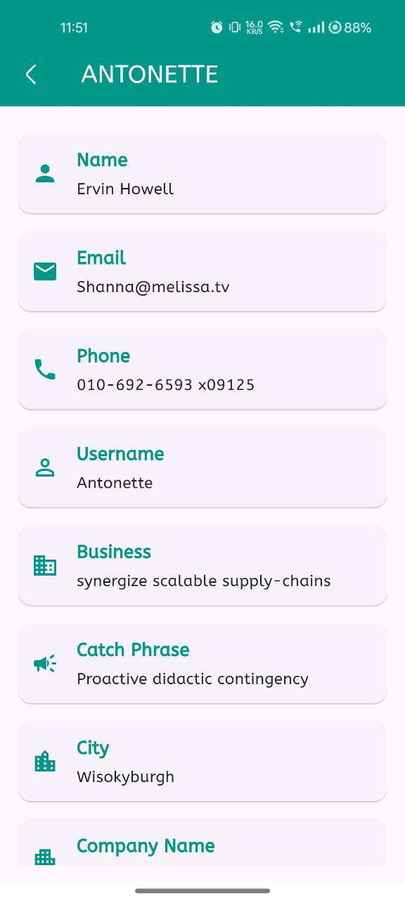

# APPSCRIP

**APPSCRIP** is an application designed to showcase user details on the home page and provide detailed information for each user when their respective card is clicked. It includes a search feature to filter users by name and utilizes the Google font "aBeeZee" for a clean and readable text display.

## Features

- **Home Page**: Displays a list of users with their basic details.
- **User Details**: Click on a user card to view more information.
- **Search Functionality**: Search for users by name to quickly find specific individuals.

## Screenshots




## Installation

To get started with APPSCRIP, clone the repository and install the necessary dependencies:

```
git clone <https://github.com/adnan-vk/Appscrip>
```
```
cd APPSCRIP
```
```
npm install
```
